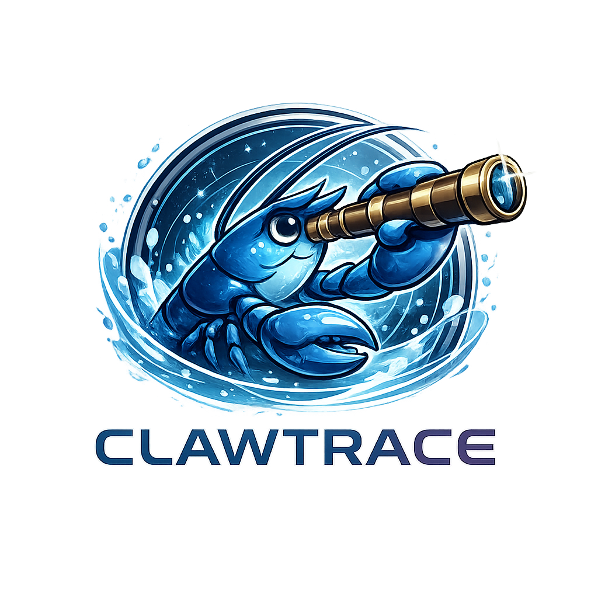

<div align="center">



<br><br>

### The Trace Explorer for OpenClaw Agents

**30 analysis views. Zero dependencies. 100% offline. One HTML file.**

[](LICENSE)
[](#-whats-new-in-v20)
[](CONTRIBUTING.md)
[](SECURITY.md)
[](#-tech-stack)
[](#-privacy-guarantee)

---

*A free, open-source, zero-dependency web tool that lets you load, explore, replay, debug, benchmark, and understand AI interaction traces -- entirely in your browser, with absolute privacy.*

**Built for [OpenClaw](https://github.com/openclaw/openclaw) agents. Works with any AI system.**

[**Get Started**](#-quick-start) · [**What's New in v2.0**](#-whats-new-in-v20) · [**All 30 Features**](#-features) · [**Security**](#-security-philosophy) · [**How to Use**](#-how-to-use)

</div>

---

## What is Clawtrace?

**Clawtrace** is a browser-based trace explorer purpose-built for [OpenClaw](https://openclaw.ai/) agents and compatible with any AI system.

You feed it the raw logs from an OpenClaw session -- or any AI trace (OpenAI, Anthropic, LangChain, custom agents) -- and it gives you **30 interactive analysis views** across 6 categories:

| Category | Views |
|----------|-------|
| **Core Analysis** | Timeline, Reasoning Analyzer, Comparison, Hallucination Heatmap, Behavior Radar, Reasoning Flow Graph, Trace Replay |
| **OpenClaw Intelligence** | Session Inspector, Tool Profiler, Agent-to-Agent Map, Channel Diff, Routing Visualizer, Chat Commands, Skill Graph, Canvas Replay, Voice Viewer, Browser Replay, Node Activity, Cron Timeline |
| **Security** | Prompt Injection Scanner, Sandbox Boundary Inspector |
| **Optimization** | Token Cost Calculator, Performance Benchmark, Model Failover Analyzer, Config Recommendations |
| **Export & Sharing** | Multi-Format Export, Bug Report Generator, Trace-to-Issue Pipeline, Anonymized Export |
| **Input** | Paste, file upload, drag-and-drop, example loader |

Everything runs **100% in your browser**. Nothing is uploaded. Nothing is tracked. Nothing phones home. **10,000+ lines of hand-written JavaScript, zero dependencies.**

---

## Built for OpenClaw

[**OpenClaw**](https://openclaw.ai/) is the open-source personal AI assistant with 207k+ GitHub stars, created by [Peter Steinberger](https://steipete.me/) and an incredible community. It runs on your own devices via a local Gateway (`ws://127.0.0.1:18789`) and connects to WhatsApp, Telegram, Slack, Discord, Signal, iMessage, Microsoft Teams, Matrix, Google Chat, WebChat, and more.

OpenClaw agents use models like Claude Opus 4, GPT-4o, and others to execute complex multi-step tasks through the Pi agent runtime. These interactions generate rich traces -- and that's where Clawtrace comes in.

**Clawtrace v2.0 is the most comprehensive trace debugger for OpenClaw agents.** It understands:

| OpenClaw Concept | What Clawtrace Does |
|-----------------|-------------------|
| **Pi Agent Runtime** | Replays agent loops step-by-step, detects infinite loops, measures efficiency |
| **Tool Calls** (`bash`, `browser`, `canvas`, `cron`, etc.) | Profiles every tool by category, frequency, and execution chain |
| **Multi-Agent** (`sessions_send`, `sessions_spawn`) | Maps agent-to-agent message flows with targets and flags |
| **Channels** (WhatsApp, Telegram, Discord, etc.) | Diffs message length limits, formatting compatibility, chunking behavior |
| **Gateway Routing** | Visualizes Channel > Gateway > Agent > Tools flow with policy detection |
| **Sessions & Context** | Inspects session metadata, context window usage, /compact recommendations |
| **Skills** (`~/.openclaw/workspace/skills/`) | Graphs skill-to-tool dependencies for builtin and custom skills |
| **Canvas / A2UI** | Replays `canvas.push`, `canvas.reset`, `canvas.eval` operations |
| **Voice** (Wake + Talk Mode) | Visualizes the voice pipeline: Wake > Record > Transcribe > Process > Synthesize |
| **Browser Actions** | Replays navigate, click, type, scroll, snapshot sequences |
| **Cron & Automation** | Timelines `cron.create/list/delete`, webhooks, gmail triggers, scheduled events |
| **Chat Commands** (`/status`, `/compact`, `/think`, etc.) | Analyzes command frequency, patterns, and usage |
| **Model Failover** | Detects model switches, compares performance across failover events |
| **Sandbox Mode** | Inspects sandbox boundaries -- which tools are allowed vs denied per session |
| **Node Activity** | Dashboards device platform features: location, camera, screen, system calls |
| **Prompt Injection** | Scans for 23 injection patterns across 4 severity levels |
| **Config Tuning** | Recommends `openclaw.json` settings based on trace analysis |
| **Anonymized Export** | Redacts 8 PII patterns (emails, IPs, API keys, tokens) before sharing |

Clawtrace also works with any AI system -- OpenAI, Anthropic, LangChain, custom agents -- but every feature is designed with OpenClaw's architecture in mind.

> **Disclaimer:** Clawtrace is an **independent community project**. It is not made by, affiliated with, or endorsed by the OpenClaw team. We're simply contributing to the ecosystem because we believe OpenClaw users deserve great debugging tools.

> **Links:** [OpenClaw Website](https://openclaw.ai/) | [OpenClaw GitHub](https://github.com/openclaw/openclaw) | [OpenClaw Docs](https://docs.openclaw.ai/) | [OpenClaw Discord](https://discord.gg/clawd) | [@openclaw on X](https://x.com/openclaw)

---

## What's New in v2.0

**Clawtrace v2.0** is the biggest release yet -- **19 new analysis views**, a redesigned UI with categorized navigation, and an OpenClaw-aligned color palette. Every feature is purpose-built for OpenClaw agent debugging.

### OpenClaw Intelligence (12 new views)

| View | What It Does |
|------|-------------|
| **Session Inspector** | Extracts Gateway session metadata (model, thinking level, verbose, sendPolicy, workspace). Tracks context window usage against model limits. Recommends /compact when needed. |
| **Tool Profiler** | Profiles every tool call by 11 categories (execution, filesystem, browser, canvas, automation, multi-agent, device, channel, gateway, skills, search). Frequency maps, chain detection, category breakdowns. |
| **Agent-to-Agent Map** | Detects `sessions_send/list/history/spawn`. Maps targets, message flags (REPLY_SKIP, ANNOUNCE_SKIP). Circular SVG graph with directional arrows. |
| **Channel Diff** | Compares traces across 13 channels with message length limits (WhatsApp 65K, Telegram 4K, Discord 2K). Analyzes chunking needs, formatting compatibility. |
| **Routing Visualizer** | SVG flow diagram: Channels > Gateway > Agent > Tools. Detects dmPolicy, activation mode, allowFrom. Security posture checks. |
| **Chat Commands** | Detects 13 slash commands (/status, /new, /compact, /think, /verbose, /usage, /activation, /model, /help, /doctor, /send, /install, /skills). Frequency bars and usage patterns. |
| **Skill Graph** | Maps builtin skills (memory, calendar, contacts, etc.) and custom skills to their tool dependencies. SVG graph with skill-tool connections. |
| **Canvas Replay** | Replays `canvas.push/reset/eval/snapshot` and A2UI operations. Canvas state transitions: empty > content > modified > reset. |
| **Voice Viewer** | Visualizes voice interactions: wake word, talk mode, STT, TTS. Pipeline: Wake > Record > Transcribe > Process > Synthesize > Playback. |
| **Browser Replay** | Replays navigate, snapshot, click, type, scroll, upload, close actions. URL history timeline. |
| **Node Activity** | Dashboards device platforms (macOS, iOS, Android, Linux, Windows). Device features: location.get, camera, screen.record, system.run/notify, node.invoke. |
| **Cron Timeline** | Timelines `cron.create/list/delete/update`, webhooks, gmail triggers, scheduled events, wake-ups. Color-coded dot timeline. |

### Security (2 new views)

| View | What It Does |
|------|-------------|
| **Injection Scanner** | Scans for 23 prompt injection patterns across Critical/High/Medium/Low severity. Risk meter (0-100), findings with excerpts, security recommendations. |
| **Sandbox Inspector** | Classifies tools as sandbox-allowed (bash, read, write) vs sandbox-denied (browser, canvas, cron). SVG boundary map. Elevation detection. |

### Optimization (3 new views)

| View | What It Does |
|------|-------------|
| **Benchmark** | Efficiency score (0-100) analyzing steps, tokens, tool ratio, error rate, reasoning ratio. Optimization tips. |
| **Failover Analyzer** | Detects 12 model patterns (Claude Opus 4.6, GPT-5.2, GPT-4o, Gemini, etc.). Model switches, failover events, performance comparison table. |
| **Config Recommender** | Analyzes trace patterns and suggests `openclaw.json` settings. Generates copy-pasteable JSON config snippet. |

### Export (2 new views)

| View | What It Does |
|------|-------------|
| **Trace-to-Issue** | Generates GitHub issue templates with title, description, environment, steps to reproduce, errors, failed tools. Copy-to-clipboard. |
| **Anonymized Export** | Redacts 8 PII patterns (email, IP, API key, UUID, bearer token, password, file path, phone number) before downloading. |

### UI Overhaul

- **OpenClaw-aligned color palette**: Lobster coral accent (`#FF4500`), dark backgrounds (`#0D1117` / `#161B22`)
- **Categorized navigation**: 6 groups (Core, OpenClaw, Security, Optimize, Export, Input) with labeled sections
- **30 nav buttons** organized by function, not by creation order
- Dark/light mode with updated accent colors throughout

---

## Who It's For

| Role | Use Case |
|------|----------|
| **OpenClaw Users** | Debug agent loops, inspect skill executions, replay multi-channel sessions, tune configs, catch when your agent gets stuck |
| **OpenClaw Developers** | Profile tool chains, map multi-agent flows, benchmark performance, scan for prompt injection, test sandbox boundaries |
| **AI Engineers** | Debug agent loops, inspect tool call sequences, catch infinite recursion, compare model performance |
| **Prompt Engineers** | Analyze how prompt changes affect reasoning quality, confidence, and hallucination rates |
| **QA Teams** | Review AI traces for production incidents, regressions, and security issues |
| **Security Auditors** | Scan for prompt injection, inspect sandbox boundaries, review routing policies, export anonymized traces |
| **Researchers** | Study AI reasoning patterns, hallucination rates, failure modes, and tool usage distributions |
| **Educators** | Teach AI concepts with real, interactive trace visualizations |

---

## Features

### Core Analysis (7 views)

**Interactive Timeline** -- Color-coded steps (User, Assistant, Tool Call, Reasoning, Error, System) with expand/collapse, filtering by type, step metadata, and keyboard navigation.

**Reasoning Analyzer** -- Auto-detects infinite loops (near-duplicate steps), repetition patterns (Jaccard similarity), hallucination indicators (self-corrections, knowledge cutoff references), contradictions, and uncertainty language. Outputs risk meter (0-100), confidence score, severity-tagged warning flags, and evidence excerpts.

**Comparison Mode** -- Side-by-side diff of two traces with step-level alignment, change highlighting (same, changed, added, removed), and summary statistics.

**Hallucination Heatmap** -- Word-level severity highlighting (Critical, High, Medium, Low) using 13 regex patterns across hallucination, uncertainty, contradiction, and hedging categories. Summary cards per severity, per-step breakdowns, color legend.

**Behavior Radar** -- SVG spider chart profiling 6 behavioral dimensions: Verbosity, Confidence, Tool Reliance, Repetitiveness, Hedging, Error Rate. Background rings, filled polygon, interactive dots, detailed score cards with bar fills.

**Reasoning Flow Graph** -- Interactive SVG node graph of AI decision flow. Left-to-right layout with branching for tool calls, loop detection (dashed red edges), zoom/pan/mouse wheel, color-coded nodes, arrow markers, up to 100 visible nodes.

**Trace Replay** -- Animated step-by-step playback with typing animation, play/pause/restart, step forward/back, speed control (0.5x to 4x), color-coded pulse indicators, progress bar, auto-scroll, ARIA live region.

### OpenClaw Intelligence (12 views)

**Session Inspector** -- Extracts session metadata (sessionId, model, thinkingLevel, verbose, sendPolicy, groupActivation, elevated, workspace, agentName). Analyzes context window usage against model limits (Claude Opus 4.6 = 200K, GPT-4o = 128K, Gemini = 1M, etc.). Token accumulation SVG curve. Recommendations for /compact, /verbose off, thinking level adjustments. Session pruning advisor.

**Tool Profiler** -- Categorizes tools into 11 groups: execution, filesystem, browser, canvas, automation, multi-agent, device, channel-action, gateway, skills, search. Summary stats, category breakdown bars, tool detail table, tool chain detection (consecutive tool calls), SVG frequency map.

**Agent-to-Agent Map** -- Detects `sessions_send`, `sessions_list`, `sessions_history`, `sessions_spawn`. Extracts targets, REPLY_SKIP/ANNOUNCE_SKIP flags. Summary stats (agents, messages, unique targets), circular SVG graph with directional arrows, interaction log.

**Channel Diff** -- Analyzes traces across 13 channels with message length limits: WhatsApp (65,536), Telegram (4,096), Discord (2,000), Slack (40,000), Signal (6,000), iMessage (20,000), Teams (28,000), Matrix (65,536), Google Chat (4,096), WebChat (unlimited), Zalo (5,000), Email (unlimited), SMS (1,600). Chunking analysis, formatting compatibility checks, response length distribution.

**Routing Visualizer** -- SVG flow diagram: Channels > Gateway > Agent > Tools. Detects dmPolicy, activation mode, allowFrom configuration. Config details grid, security posture checks with pass/fail indicators.

**Chat Command Analyzer** -- Detects 13 slash commands: `/status`, `/new`, `/compact`, `/think`, `/verbose`, `/usage`, `/activation`, `/model`, `/help`, `/doctor`, `/send`, `/install`, `/skills`. Each with description, frequency bar, command usage timeline.

**Skill Dependency Graph** -- Detects builtin skills (memory, calendar, contacts, reminders, smart-home, music, weather, news, translate, fitness, shortcuts, notes, photos, files, web-search) and custom skills (`~/.openclaw/workspace/skills/`). SVG graph with skill-tool connections, category coloring.

**Canvas / A2UI Replay** -- Detects `canvas.push`, `canvas.reset`, `canvas.eval`, `canvas.snapshot`, A2UI references. Operation timeline, canvas state transitions (empty > content > modified > reset), action counts.

**Voice Interaction Viewer** -- Detects voice wake, talk mode, STT, TTS, audio processing, microphone events. Voice pipeline visualization: Wake > Record > Transcribe > Process > Synthesize > Playback. Event counts and timeline.

**Browser Session Replay** -- Detects navigate, snapshot, click, type, scroll, upload, close actions. Action sequence timeline, URL history, action type counts.

**Node Activity Dashboard** -- Detects device platforms: macOS, iOS, Android, Linux, Windows. Device features: `location.get`, `camera.*`, `screen.record`, `system.run`, `system.notify`, `node.invoke`. Platform detection, feature inventory, activity counts.

**Cron & Automation Timeline** -- Detects `cron.create`, `cron.list`, `cron.delete`, `cron.update`, webhook triggers, gmail triggers, scheduled events, wake-ups. Visual timeline with color-coded dots, event type summary, chronological log.

### Security (2 views)

**Prompt Injection Scanner** -- 23 patterns across 4 severity levels (Critical, High, Medium, Low) covering instruction override, role hijacking, context manipulation, encoding attacks, and social engineering. Risk meter (0-100), findings list with step references and excerpts, actionable security recommendations.

**Sandbox Boundary Inspector** -- Classifies tools as sandbox-allowed (`bash`, `read`, `write`, `edit`, `search`) vs sandbox-denied (`browser`, `canvas.*`, `cron.*`, `sessions_send`, `system.run`, `camera.*`). SVG boundary map, elevation detection, sandbox policy summary.

### Optimization (4 views)

**Token Cost Calculator** -- Token estimation for input/output across 20 models from 7 providers (OpenAI, Anthropic, Google, Meta, Mistral, DeepSeek, o-series). Auto-detects model used in trace. Summary cards (total tokens, cheapest, most expensive), sortable comparison table.

**Performance Benchmark** -- Efficiency score (0-100) based on total steps, estimated tokens, tool call ratio, error rate, and reasoning ratio. Per-metric scoring with color-coded grades. Optimization tips tailored to the trace.

**Model Failover Analyzer** -- Detects 12 model patterns (Claude Opus 4.6, Claude Sonnet, GPT-5.2, GPT-4o, GPT-4o-mini, Gemini 2.5, Gemini 2.0, Llama, Mistral, DeepSeek, Grok, local models). Model switches, failover events, performance comparison table (steps, tokens, errors per model).

**Config Recommendation Engine** -- Analyzes trace patterns to suggest `openclaw.json` settings: model, thinkingLevel, verbose, dmPolicy, sandboxMode, tokenLimit, failoverModels. Generates copy-pasteable JSON config snippet with explanations for each recommendation.

### Export & Sharing (4 views)

**Multi-Format Export** -- JSON (full trace + analysis), Markdown (human-readable report with tables), HTML (self-contained printable report with embedded styling). Includes OpenClaw-formatted exports.

**Bug Report Generator** -- One-click generation in 3 formats: GitHub Issue (Markdown), Jira (markup), Plain Text. Includes summary table, error list, critical warnings, tool calls, trace snippet. Copy-to-clipboard with visual feedback. OpenClaw environment info auto-populated.

**Trace-to-Issue Pipeline** -- Generates GitHub issue templates: title, description, environment (Clawtrace version, browser, OS, model), steps to reproduce, error summary, failed tools list. One-click copy-to-clipboard.

**Anonymized Trace Export** -- Redacts 8 PII patterns: email addresses, IP addresses, API keys, UUIDs, bearer tokens, passwords, file paths, phone numbers. Preview redaction count before downloading. Exports clean JSON safe for sharing.

### Input

**Multi-Format Input** -- Drag-and-drop, file picker, paste, or load example. Supports JSON, TXT, YAML-like, MD, and LOG files. Auto-detects format. Handles OpenAI, Anthropic, OpenClaw, and generic message formats. `messages`, `steps`, `trace`, `events` wrapper keys supported. 5 MB size limit.

### UI/UX

- **OpenClaw coral palette** -- `#FF4500` accent, `#0D1117` dark background
- **Categorized navigation** -- 6 labeled groups: Core, OpenClaw, Security, Optimize, Export, Input
- **Dark/light mode** with theme toggle
- **Fully responsive** -- desktop, tablet, mobile
- **Reduced-motion support** -- respects `prefers-reduced-motion`
- **Print stylesheet** for physical reports
- **ARIA labels and roles** throughout
- **Skip-to-content link** for keyboard users

---

## Quick Start

### Option 1: Open Directly

```bash
git clone https://github.com/DosukaSOL/clawtrace.git
cd clawtrace
open index.html    # macOS
# or: xdg-open index.html (Linux) / start index.html (Windows)
```

That's it. No install. No build. No npm. No configuration.

### Option 2: Serve Locally (recommended for Share URLs)

```bash
cd clawtrace
python3 -m http.server 8080
# Open http://localhost:8080
```

### Option 3: Deploy to Static Hosting

Upload the entire `clawtrace/` folder to any static host:
- GitHub Pages, Netlify, Vercel, Cloudflare Pages, or any web server

See [docs/DEPLOYMENT.md](docs/DEPLOYMENT.md) for detailed instructions with recommended security headers.

---

## How to Use

### Step 1: Load Trace Data

| Method | How |
|--------|-----|
| **Paste** | Copy your AI trace JSON/text and paste into the text area |
| **File** | Click "Choose File" or drag and drop a `.json`/`.txt`/`.yaml` file |
| **Example** | Click "Load Example" to explore with a built-in OpenClaw sample trace |

### Step 2: Parse & Analyze

Click **"Parse & Analyze"**. Clawtrace will:
1. Auto-detect the format (JSON, YAML, plain text)
2. Parse and normalize into a clean internal schema
3. Run all 30 analysis engines simultaneously
4. Switch you to the Timeline view automatically

### Step 3: Explore the 30 Views

Navigate using the **categorized nav bar**:

| Category | Views |
|----------|-------|
| **Core** | Timeline, Analyzer, Compare, Heatmap, Radar, Flow, Replay |
| **OpenClaw** | Session, Tools, Agents, Channels, Routing, Chat Cmds, Skills, Canvas, Voice, Browser, Nodes, Cron |
| **Security** | Inj. Scan, Sandbox |
| **Optimize** | Cost, Benchmark, Failover, Config |
| **Export** | Export, Bug Report, Issue, Anonymize |

### Step 4: Share (Optional)

In the **Export** view, click **"Generate Share URL"**. The trace data is encoded into the URL fragment -- no server involved. Or use **Anonymize** to strip PII before sharing.

---

## Supported Formats

### JSON (Auto-detected)

```json
[
  { "role": "user", "content": "Hello" },
  { "role": "assistant", "content": "Hi! How can I help?" }
]
```

Also supports:
- `{ "messages": [...] }` / `{ "steps": [...] }` / `{ "trace": [...] }` / `{ "events": [...] }`
- Messages with `tool_calls` arrays (OpenAI, OpenClaw)
- Multi-part content arrays
- OpenClaw agent traces with `bash`, `browser`, `write`, `canvas.*`, `cron.*`, and other tool calls
- OpenClaw `sessions_send` / `sessions_list` / `sessions_history` / `sessions_spawn` traces
- OpenClaw skill execution traces

### YAML-like (Auto-detected)

```yaml
role: user
content: Hello

role: assistant
content: Hi! How can I help?
```

### Plain Text (Fallback)

```
User: Hello
Assistant: Hi! How can I help?
```

---

## Tech Stack

| Component | Technology |
|-----------|-----------|
| Markup | HTML5, semantic elements |
| Styling | CSS3, custom properties, media queries (~2,700 lines) |
| Logic | Vanilla JavaScript, ES5 compatible (~10,000 lines) |
| Modules | 33 JS files, IIFE pattern with `Clawtrace` namespace |
| Charts | SVG via `document.createElementNS` -- no chart library |
| Security | Sanitizer module, strict CSP, no innerHTML |
| Dependencies | **Zero** |
| Build tools | **None** |
| External APIs | **None** |
| Tracking | **None** |
| Frameworks | **None** |

The entire application is ~300 KB of hand-written code. It loads instantly and works forever.

---

## Security Philosophy

Clawtrace is built with a **security-first** mindset. We believe developer tools should be **safe by default**.

### Core Principles

1. **Zero Network Calls** -- No data ever leaves your browser. No fetch, no XHR, no WebSocket, no beacon, no image pixel tracking. Verified by Content Security Policy with `connect-src 'none'`.

2. **No External Dependencies** -- No npm packages, no CDN scripts, no third-party code. Every line of code is auditable in this repository.

3. **Input Sanitization** -- All user input is treated as untrusted. Content is escaped before rendering. DOM manipulation uses `textContent` and `createElement` -- never `innerHTML` with user data. A dedicated `Sanitizer` module enforces safe rendering across all 33 modules.

4. **Content Security Policy** -- Strict CSP meta tag blocks inline scripts, external resources, iframes, and form submissions: `default-src 'none'; script-src 'self'; style-src 'self'; img-src 'self' data:; connect-src 'none'; frame-src 'none'; object-src 'none'; base-uri 'self'; form-action 'none'`.

5. **Size & Depth Limits** -- Input is limited to 5 MB. JSON nesting is limited to 20 levels. Arrays are capped at 10,000 elements. These prevent denial-of-service via resource exhaustion.

6. **Safe File Handling** -- File type validation by extension and MIME type. File size validation before reading.

7. **No Secrets** -- This codebase contains zero API keys, tokens, credentials, endpoints, or sensitive data.

8. **Security Audit** -- All 33 JS files (10,000+ lines) have been audited for `innerHTML`, `eval()`, `document.write()`, `new Function()`, `fetch()`, and `XMLHttpRequest`. Zero violations found.

See [SECURITY.md](SECURITY.md) for the full threat model, audit report, and responsible disclosure policy.

---

## Privacy Guarantee

- Your trace data **never leaves your browser**
- There are **no analytics** of any kind
- There is **no telemetry**
- There are **no cookies** (theme preference uses `localStorage` only)
- Share URLs encode data in the **URL fragment** (hash), which [browsers do not send to servers](https://developer.mozilla.org/en-US/docs/Web/API/URL/hash)
- The application works **completely offline** after the initial page load
- The **Anonymized Export** feature lets you redact PII before sharing any trace

**We don't want your data. We can't see your data. That's the point.**

---

## Project Structure

```
clawtrace/
  index.html                   # Application entry point (30 views, 33 scripts)
  src/
    css/
      style.css                # Complete design system (~2,700 lines)
    js/
      sanitizer.js             # Security foundation: escaping, validation
      parser.js                # Multi-format parser with auto-detection
      app.js                   # Main orchestrator (wires 32 modules)
      # -- Core Analysis --
      timeline.js              # Interactive timeline renderer
      analyzer.js              # Reasoning analysis engine
      comparison.js            # Side-by-side diff engine
      heatmap.js               # Hallucination heatmap engine
      radar.js                 # AI behavior radar chart (SVG)
      flowgraph.js             # Reasoning flow graph (SVG)
      replay.js                # Trace replay with typing animation
      # -- OpenClaw Intelligence --
      session.js               # Gateway session inspector
      toolprofiler.js          # Tool call profiler (11 categories)
      agentmap.js              # Agent-to-agent flow mapper
      channeldiff.js           # Multi-channel trace diff
      routing.js               # Channel routing visualizer
      chatcmd.js               # Chat command analyzer
      skillgraph.js            # Skill dependency graph
      canvasreplay.js          # Canvas/A2UI action replay
      voiceview.js             # Voice interaction viewer
      browserreplay.js         # Browser session replay
      nodeactivity.js          # Node activity dashboard
      crontimeline.js          # Cron & automation timeline
      # -- Security --
      injscan.js               # Prompt injection scanner
      sandbox.js               # Sandbox boundary inspector
      # -- Optimization --
      costcalc.js              # Token cost calculator (20 models)
      benchmark.js             # Performance benchmark
      failover.js              # Model failover analyzer
      configrec.js             # Config recommendation engine
      # -- Export & Sharing --
      export.js                # Multi-format export (JSON, MD, HTML)
      share.js                 # URL-based sharing (no server)
      bugreport.js             # One-click bug report generator
      traceissue.js            # Trace-to-issue pipeline
      traceshare.js            # Anonymized trace export
  assets/
    clawtrace-logo.png         # Logo
  docs/
    DEPLOYMENT.md              # Deployment guide with security headers
    AUDIT.md                   # Security audit report
  examples/
    basic-chat.json            # Simple conversation trace
    agent-loop.json            # Multi-step agent with tool calls
    openclaw-agent.json        # OpenClaw agent trace
  README.md                    # This file
  SECURITY.md                  # Security policy & threat model
  CONTRIBUTING.md              # Contribution guidelines
  CODE_OF_CONDUCT.md           # Code of conduct
  LICENSE                      # MIT License
```

---

## Contributing

We welcome contributions! See [CONTRIBUTING.md](CONTRIBUTING.md) for full guidelines.

**Key rules:**
- No external dependencies, ever
- All DOM rendering must use safe methods (`textContent` / `createElement` via `Sanitizer`)
- All input must be sanitized through the `Sanitizer` module
- No inline JavaScript or event handlers
- No network calls
- Follow the IIFE module pattern (`Clawtrace.ModuleName = (function() { ... })()`)

---

## Roadmap

### v1.0 (complete)
- [x] Multi-format input (JSON, YAML-like, text)
- [x] Interactive timeline with filtering
- [x] Reasoning analyzer with risk/confidence scores
- [x] Loop, repetition, hallucination, contradiction, uncertainty detection
- [x] Side-by-side comparison
- [x] Multi-format export
- [x] URL-based sharing
- [x] Dark/light theme
- [x] Full accessibility
- [x] Security audit

### v1.1 (complete)
- [x] Trace Replay Mode with typing animation and speed control
- [x] Hallucination Heatmap with word-level severity
- [x] AI Behavior Radar Chart (SVG, 6 dimensions)
- [x] Token Cost Calculator (20 models, 7 providers)
- [x] One-Click Bug Report Generator (GitHub, Jira, text)
- [x] Reasoning Flow Graph (interactive SVG node graph)

### v2.0 (current)
- [x] 12 OpenClaw Intelligence views (Session, Tools, Agents, Channels, Routing, Chat Cmds, Skills, Canvas, Voice, Browser, Nodes, Cron)
- [x] 2 Security views (Injection Scanner, Sandbox Inspector)
- [x] 3 Optimization views (Benchmark, Failover Analyzer, Config Recommender)
- [x] 2 Export views (Trace-to-Issue, Anonymized Export)
- [x] OpenClaw-aligned color palette (#FF4500 coral)
- [x] Categorized navigation (6 groups, 30 buttons)
- [x] Full security audit (0 violations across 10,000+ lines)

### v2.1 (planned)
- [ ] Timeline search / text filter
- [ ] Keyboard shortcut system
- [ ] Bookmarkable steps
- [ ] Custom analysis rules
- [ ] Local IndexedDB storage (opt-in)
- [ ] Trace annotation / comments
- [ ] WebAssembly parser for massive traces
- [ ] Plugin system for custom analyzers
- [ ] OpenTelemetry trace format support
- [ ] Community pattern library

---

## Why Open Source?

AI tools should be transparent. If a tool analyzes AI behavior, you should be able to analyze *the tool itself*. Every line of Clawtrace is open, auditable, and yours to inspect.

We chose MIT because we believe utility tools should be free to use, modify, and distribute without restriction.

---

## FAQ

**Q: Does this send my data anywhere?**
A: No. Never. The CSP meta tag enforces `connect-src 'none'`, blocking all network requests. Zero external calls in the code.

**Q: Can I use this with any AI provider?**
A: Yes. Clawtrace accepts any JSON message array, YAML-like key-value data, or plain text conversation. It auto-detects the format.

**Q: How do I use this with OpenClaw?**
A: Export your OpenClaw agent session history (via `sessions_history` or Gateway logs), paste or drop the JSON into Clawtrace, and click Parse & Analyze. Clawtrace understands OpenClaw's full tool call format -- `bash`, `browser`, `canvas.*`, `cron.*`, skill executions, `sessions_send` multi-agent traces, voice interactions, and more. The built-in example trace is an OpenClaw session demonstrating `/status`, `cron.list`, `bash`, `sessions_send`, and `/compact`. There's also `examples/openclaw-agent.json` with a calendar skill execution.

**Q: Is the share URL secure?**
A: The data is base64-encoded (not encrypted) in the URL fragment. Browsers don't send fragments to servers. However, the URL is readable by anyone who has it. Use the **Anonymized Export** to strip PII before sharing sensitive traces.

**Q: Why no React/Vue/Svelte?**
A: Deliberately. Zero dependencies = zero supply chain attacks, instant loading, no build step, code that runs forever without maintenance.

**Q: Why 33 separate JS files instead of bundling?**
A: Each module is self-contained with a clear responsibility. No build step means you can read, audit, and modify any module directly. The IIFE pattern with the `Clawtrace` namespace provides clean encapsulation without a bundler.

**Q: Can I embed this in my app?**
A: Yes. MIT licensed. Copy the files, serve them. No attribution required (but appreciated).

---

## License

[MIT License](LICENSE) -- free to use, modify, and distribute.

---

<div align="center">


**Clawtrace** -- The Trace Explorer for OpenClaw Agents

[Get Started](#-quick-start) | [Report a Bug](https://github.com/DosukaSOL/clawtrace/issues) | [Request a Feature](https://github.com/DosukaSOL/clawtrace/issues)

MIT License | Made with care by [DosukaSOL](https://github.com/DosukaSOL)

Independent community project | Not affiliated with or endorsed by the [OpenClaw](https://openclaw.ai/) team

</div>
