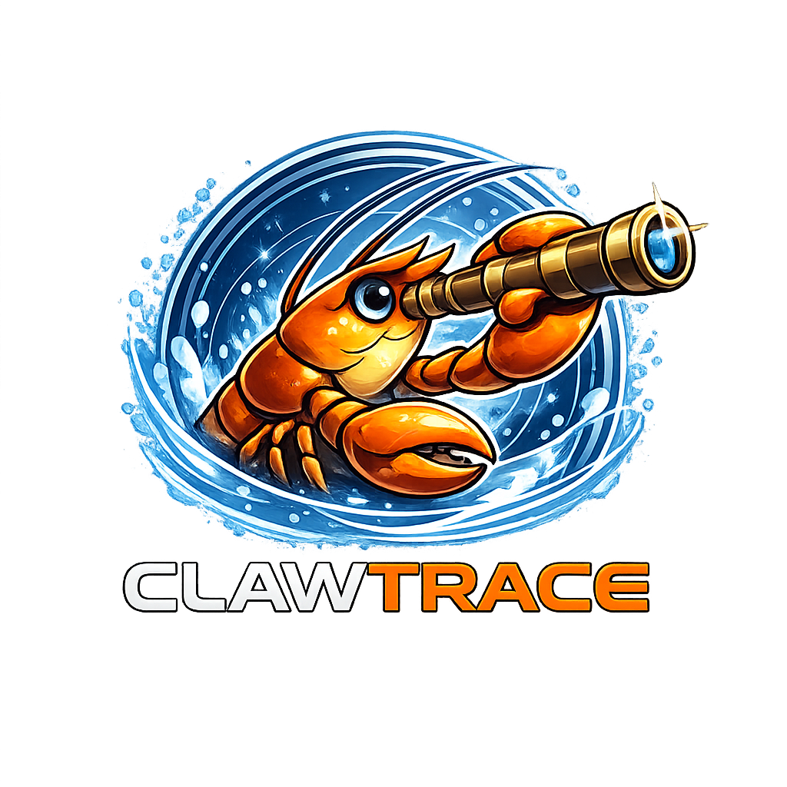

# Clawtrace Showcase Visualizer

> This is a **demo visualizer** for Clawtrace. It shows the UI, features, and fake data, but does NOT contain any real code or analysis logic.

---

## 🦞 Clawtrace Logo



---

## Landing Page

**Clawtrace** is a zero-dependency, 100% client-side trace explorer that helps you load, visualize, debug, replay, benchmark, and understand AI interaction traces &mdash; entirely in your browser with absolute privacy.

Built for **OpenClaw** agents and compatible with any AI system (OpenAI, Anthropic, LangChain, custom).

---

## Features

- **30 Analysis Views**: Timeline, heatmap, radar, flow graph, cost calculator, injection scanner, and 24 more.
- **100% Offline & Private**: No network calls, no tracking, no server. Everything stays in your browser.
- **OpenClaw Native**: Session inspector, multi-agent map, channel routing, canvas replay, voice viewer, and more.
- **Zero Dependencies**: 10,000+ lines of hand-written vanilla JS. No build step. Just open in a browser.

---

## Demo Data (Fake)

```
{
  "role": "system",
  "content": "You are Pi, an OpenClaw AI agent. Connected via Gateway (ws://127.0.0.1:18789). Session: main. Model: claude-opus-4-6. Thinking: medium. Verbose: on. Send policy: manual. dmPolicy: allowList. activation: mention. allowFrom: lorenzo, work-assistant, research-bot. Channels: WhatsApp (connected, limit: 4096), Telegram (connected, limit: 4096), Discord (connected, limit: 2000), Slack (pending). Sandbox: non-main sessions run in Docker. Workspace: /Users/lorenzo/.openclaw/workspace. Active skills: calendar, memory, weather, github, home-automation, code-review, daily-summary, custom:competitor-tracker (8 total: 7 builtin + 1 custom). Nodes: macOS-primary (active, 192.168.1.42), iPhone-14-Pro (connected), Pixel-8 (standby). Agent: Pi. API key: sk_live_oc_7f8a9b2c3d4e5f6g7h8i9j0k."
}
```

---

## UI Structure

- **Sidebar Navigation**: Home, Load Trace, Core Analysis, OpenClaw, Security, Optimize, Export
- **Header**: Logo, version, theme toggle
- **Landing View**: Big logo, summary, feature cards, CTA buttons
- **Demo Views**: Timeline, Analyzer, Comparison, Export, Replay, Heatmap, Radar, CostCalc, BugReport, FlowGraph, Session, ToolProfiler, AgentMap, ChannelDiff, Routing, ChatCmd, SkillGraph, CanvasReplay, VoiceView, BrowserReplay, NodeActivity, CronTimeline, InjScan, Sandbox, Benchmark, Failover, ConfigRec, TraceIssue, TraceShare

---

## How to Use

- This file is a **visualizer demo**. It does NOT run any code.
- Open in VS Code or any Markdown viewer to see the UI and features.
- For the real Clawtrace app, use `index.html`.

---

## Footer

Clawtrace v2.0.0 &mdash; 100% client-side &middot; zero tracking &middot; open source (MIT)

Built for [OpenClaw](https://openclaw.ai/) 🦞 agents & any AI system.

_Independent community project &middot; Not affiliated with the OpenClaw team_
